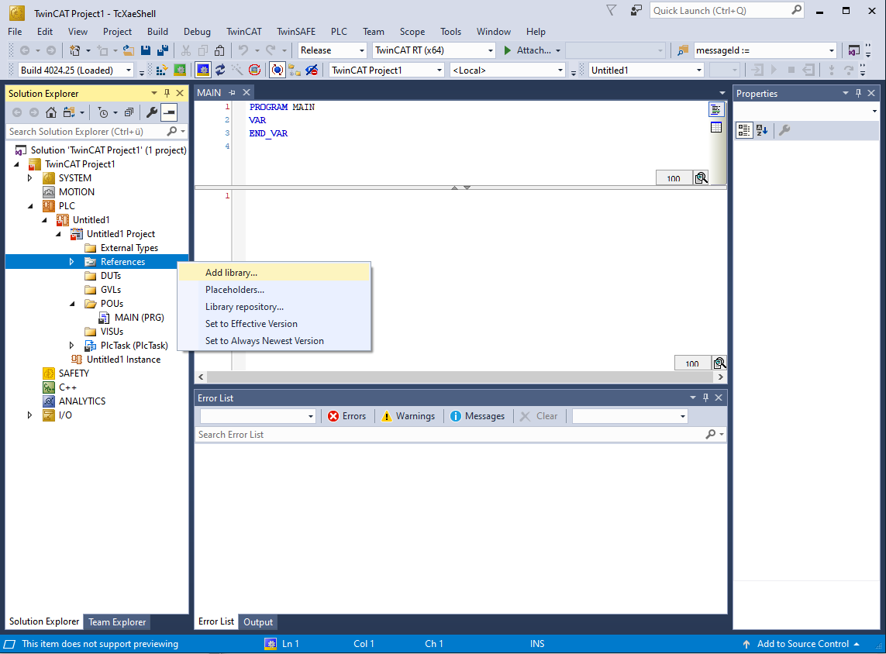
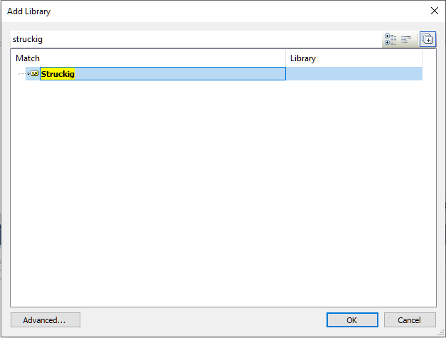

# Installation and First Motion

This page gets Struckig running in a TwinCAT project and validates the setup with a minimal 1-DoF trajectory.

## 1) Install the library

Choose one of the following:

- Download a precompiled release from [GitHub Releases](https://github.com/stefanbesler/Struckig/releases).
- Build from source in the [repository](https://github.com/stefanbesler/Struckig).

For TwinCAT users, the fastest route is usually the precompiled `.compiled-library` package.

## 2) Add Struckig to your PLC project

1. Open your TwinCAT solution.
2. In the PLC project, right-click `References`.
3. Select `Add library...`.
4. Search for `Struckig` and confirm.

After this step, `Struckig` types like `Struckig.Otg` are available in Structured Text.

<div class="gallery">
  <div class="gallery-item">
    <figure>
      
      <figcaption>Add library in TwinCAT</figcaption>
    </figure>
  </div>
  <div class="gallery-item">
    <figure>
      
      <figcaption>Select Struckig library</figcaption>
    </figure>
  </div>
</div>

## 3) Run a minimal 1-axis example

Create or replace your `MAIN` program:

```st
PROGRAM MAIN
VAR
  otg : Struckig.Otg(cycletime := 0.001, dofs := 1) := (
    EnableAutoPropagate := TRUE,
    MaxVelocity :=         [2000.0],
    MaxAcceleration :=     [20000.0],
    MaxJerk :=             [800000.0],
    CurrentPosition :=     [0.0],
    CurrentVelocity :=     [0.0],
    CurrentAcceleration := [0.0],
    TargetPosition :=      [100.0],
    TargetVelocity :=      [0.0],
    TargetAcceleration :=  [0.0]
  );
  axisTargetPosition : LREAL;
END_VAR

otg();
axisTargetPosition := otg.NewPosition[0];
```

## 4) Verify behavior

- `otg.State` should be `Busy` while the move is active, then `Idle`.
- `otg.NewPosition[0]` should move smoothly from `0.0` to `100.0`.
- Your PLC task cycle time should match `cycletime`.

> [!TIP]
> `EnableAutoPropagate := TRUE` is the standard online mode. Struckig automatically copies `New*` values back into `Current*` after each cycle.

## 5) Next steps

- Learn parameter details in [Single Axis Trajectory](single_axis_trajectory.md).
- Learn multi-axis synchronization in [Synchronized Trajectory](synchronized_trajectory.md).
- See more practical snippets in [Examples](examples_structured_text.md).
