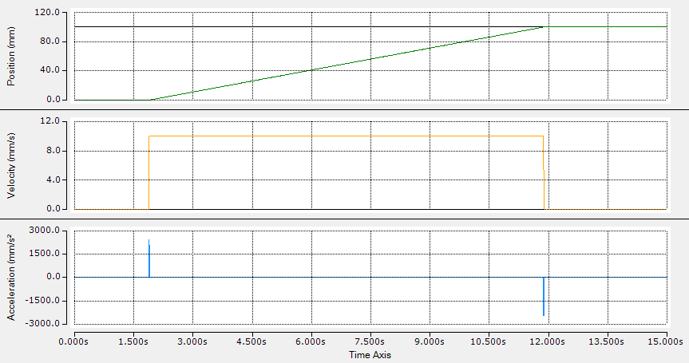
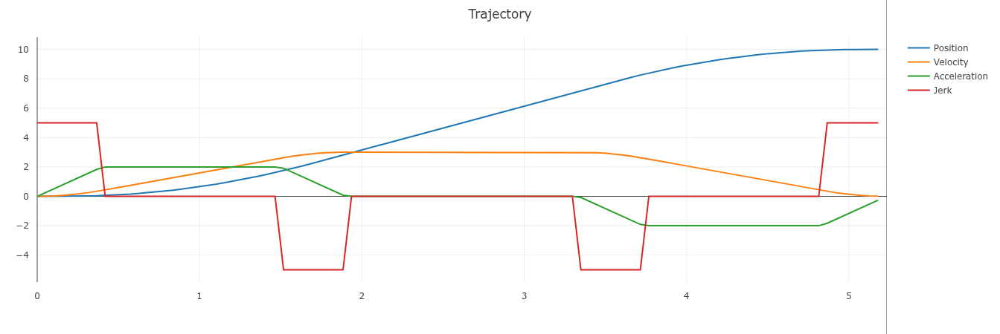
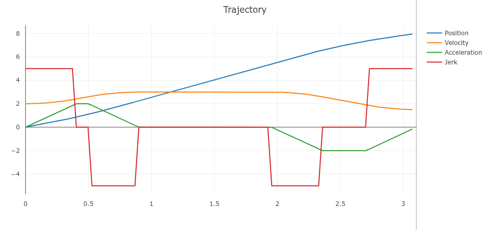
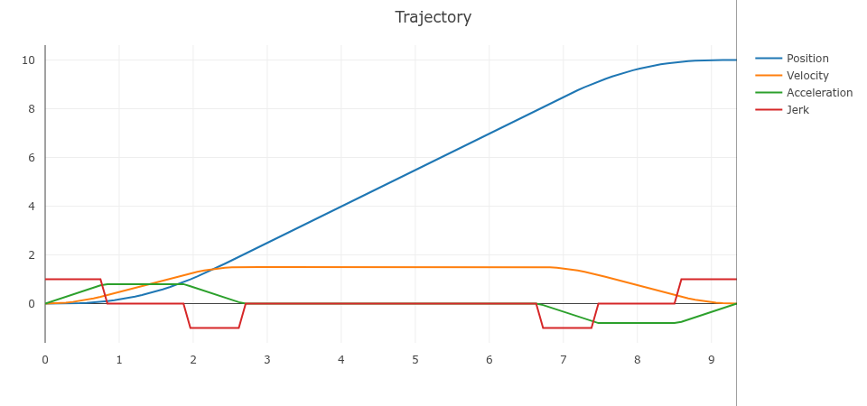

# Single axis trajectory

This example configures a time-constrained move for one axis.

## Example

```st
PROGRAM ExampleSingleAxis
VAR
  otg : Struckig.Otg(cycletime := 0.001, dofs := 1) := (
    EnableAutoPropagate := TRUE,
    Synchronization := Struckig.SynchronizationType.TimeSync,
    MinDuration := 10.0, // considered when synchronization is TimeSync
    MaxVelocity :=         [2000.0],
    MaxAcceleration :=     [20000.0],
    MaxJerk :=             [800000.0],
    CurrentPosition :=     [0.0],
    CurrentVelocity :=     [0.0],
    CurrentAcceleration := [0.0],
    TargetPosition :=      [100.0],
    TargetVelocity :=      [0.0],
    TargetAcceleration :=  [0.0]
  );
END_VAR

otg();
```

## Notes

- `MinDuration` stretches the motion only when the unconstrained solution would be faster.
- Use consistent units per axis, for example `mm`, `mm/s`, `mm/s^2`, `mm/s^3`.
- To run acceleration-only profiles, omit jerk constraints by leaving `MaxJerk` at infinity defaults.

## Visualization presets and matching ST code

These presets match the single-axis trajectories visualized in [Ruckig Web Visualization](https://gui.ruckig.com).

| Preset | current_position | current_velocity | target_position | target_velocity | max_velocity | max_acceleration | max_jerk |
| --- | ---: | ---: | ---: | ---: | ---: | ---: | ---: |
| Position | 0 | 0 | 10 | 0 | 3 | 2 | 5 |
| Velocity | 0 | 2 | 8 | 1.5 | 3 | 2 | 5 |
| Constraints | 0 | 0 | 10 | 0 | 1.5 | 0.8 | 1 |

### Position preset

```st
PROGRAM ExampleSingleAxisPositionPreset
VAR
  otg : Struckig.Otg(cycletime := 0.001, dofs := 1) := (
    EnableAutoPropagate := TRUE,
    CurrentPosition :=     [0.0],
    CurrentVelocity :=     [0.0],
    CurrentAcceleration := [0.0],
    TargetPosition :=      [10.0],
    TargetVelocity :=      [0.0],
    TargetAcceleration :=  [0.0],
    MaxVelocity :=         [3.0],
    MaxAcceleration :=     [2.0],
    MaxJerk :=             [5.0]
  );
END_VAR

otg();
```

### Velocity preset

```st
PROGRAM ExampleSingleAxisVelocityPreset
VAR
  otg : Struckig.Otg(cycletime := 0.001, dofs := 1) := (
    EnableAutoPropagate := TRUE,
    CurrentPosition :=     [0.0],
    CurrentVelocity :=     [2.0],
    CurrentAcceleration := [0.0],
    TargetPosition :=      [8.0],
    TargetVelocity :=      [1.5],
    TargetAcceleration :=  [0.0],
    MaxVelocity :=         [3.0],
    MaxAcceleration :=     [2.0],
    MaxJerk :=             [5.0]
  );
END_VAR

otg();
```

### Constraint-limited preset

```st
PROGRAM ExampleSingleAxisConstraintPreset
VAR
  otg : Struckig.Otg(cycletime := 0.001, dofs := 1) := (
    EnableAutoPropagate := TRUE,
    CurrentPosition :=     [0.0],
    CurrentVelocity :=     [0.0],
    CurrentAcceleration := [0.0],
    TargetPosition :=      [10.0],
    TargetVelocity :=      [0.0],
    TargetAcceleration :=  [0.0],
    MaxVelocity :=         [1.5],
    MaxAcceleration :=     [0.8],
    MaxJerk :=             [1.0]
  );
END_VAR

otg();
```

<div class="gallery">
  <div class="gallery-item">
    <figure>
      
      <figcaption>Single-axis trajectory profile</figcaption>
    </figure>
  </div>
  <div class="gallery-item">
    <figure>
      
      <figcaption>Position preset (Ruckig GUI)</figcaption>
    </figure>
  </div>
  <div class="gallery-item">
    <figure>
      
      <figcaption>Velocity preset (Ruckig GUI)</figcaption>
    </figure>
  </div>
  <div class="gallery-item">
    <figure>
      
      <figcaption>Constraint-limited preset (Ruckig GUI)</figcaption>
    </figure>
  </div>
</div>