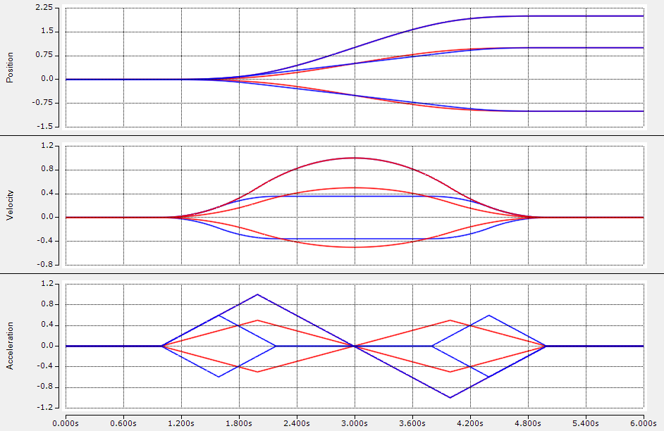

# Synchronized trajectory

This graphs shows two trajectories with three degree-of-freedem, respectively. 
The settings for both trajectories are the same with the exception of the synchronization mode. 
While red curves show the phase-synchronized trajectory, the blue ones show the time-sychronized trajectory.

## Jerk-limited trajectory (third-order trajectory)

```
  otgTimeSync : Struckig.Otg(cycletime:=0.001, dofs:=3) := (
                  EnableAutoPropagate := TRUE,
                  Synchronization := SynchronizationType.TimeSync,
                  CurrentPosition :=     [ 0.0, 0.0, 0.0 ],
                  TargetPosition :=      [ 1.0, -1.0, 2.0 ],
                  MaxVelocity :=         [ 1.0, 1.0, 1.0 ],
                  MaxAcceleration :=     [ 1.0, 1.0, 1.0 ],
                  MaxJerk :=             [ 1.0, 1.0, 1.0 ]
  ); 
  
  otgPhaseSync : Struckig.Otg(cycletime:=0.001, dofs:=3) := (
                  EnableAutoPropagate := TRUE,
                  Synchronization := SynchronizationType.Phase,
                  CurrentPosition :=     [ 0.0, 0.0, 0.0 ],
                  TargetPosition :=      [ 1.0, -1.0, 2.0 ],
                  MaxVelocity :=         [ 1.0, 1.0, 1.0 ],
                  MaxAcceleration :=     [ 1.0, 1.0, 1.0 ],
                  MaxJerk :=             [ 1.0, 1.0, 1.0 ]
  ); 
```

<div class="gallery">
  <div class="gallery-item">
    <figure>
      
    </figure>
  </div>
</div>

## Infinite-jerk trajectory (second-order trajectory)

```
  otgTimeSync : Struckig.Otg(cycletime:=0.001, dofs:=3) := (
                  EnableAutoPropagate := TRUE,
                  Synchronization := SynchronizationType.TimeSync,
                  CurrentPosition :=     [ 0.0, 0.0, 0.0 ],
                  TargetPosition :=      [ 1.0, -1.0, 2.0 ],
                  MaxVelocity :=         [ 1.0, 1.0, 1.0 ],
                  MaxAcceleration :=     [ 1.0, 1.0, 1.0 ]
                  // note: MaxJerk by default is Struckig.Constants.Infinity -> no jerk limit
  ); 
  
  otgPhaseSync : Struckig.Otg(cycletime:=0.001, dofs:=3) := (
                  EnableAutoPropagate := TRUE,
                  Synchronization := SynchronizationType.Phase,
                  CurrentPosition :=     [ 0.0, 0.0, 0.0 ],
                  TargetPosition :=      [ 1.0, -1.0, 2.0 ],
                  MaxVelocity :=         [ 1.0, 1.0, 1.0 ],
                  MaxAcceleration :=     [ 1.0, 1.0, 1.0 ]
                  // note: MaxJerk by default is Struckig.Constants.Infinity -> no jerk limit
  ); 
```

<div class="gallery">
  <div class="gallery-item">
    <figure>
      
    </figure>
  </div>
</div>
