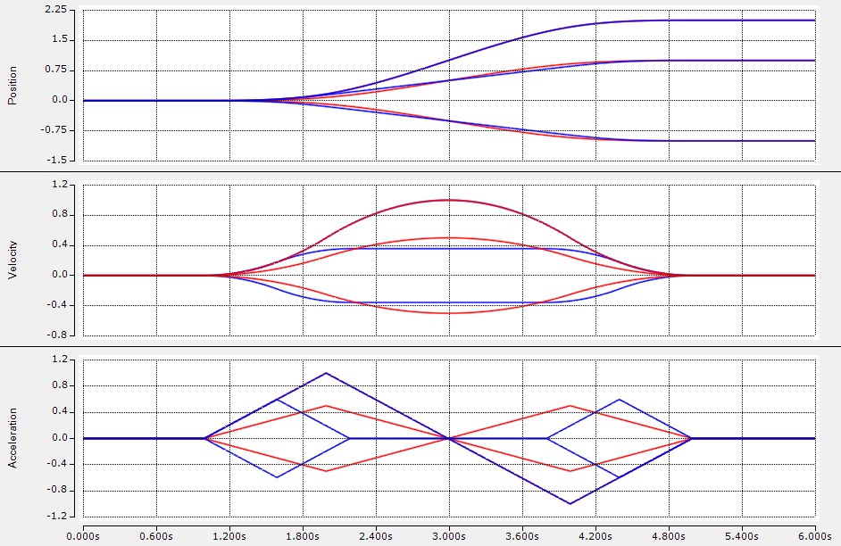
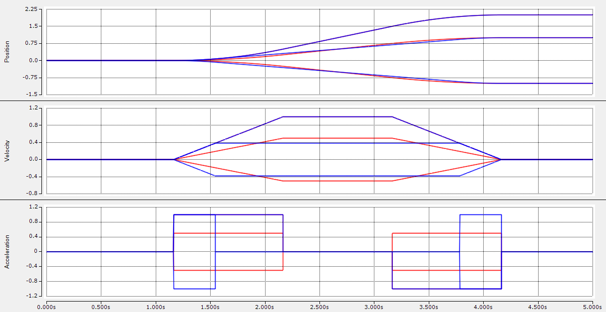

# Synchronized trajectory

For multiple DoFs, synchronization determines how axes arrive at the target.

## Time synchronization

All axes start and finish together, but can follow different geometric progress along the path.

```st
otgTimeSync : Struckig.Otg(cycletime := 0.001, dofs := 3) := (
  EnableAutoPropagate := TRUE,
  Synchronization := Struckig.SynchronizationType.TimeSync,
  CurrentPosition := [0.0, 0.0, 0.0],
  TargetPosition :=  [1.0, -1.0, 2.0],
  MaxVelocity :=     [1.0, 1.0, 1.0],
  MaxAcceleration := [1.0, 1.0, 1.0],
  MaxJerk :=         [1.0, 1.0, 1.0]
);
```

## Phase synchronization

Axes maintain a shared phase relation over time, which is useful for coordinated Cartesian motion.

```st
otgPhaseSync : Struckig.Otg(cycletime := 0.001, dofs := 3) := (
  EnableAutoPropagate := TRUE,
  Synchronization := Struckig.SynchronizationType.Phase,
  CurrentPosition := [0.0, 0.0, 0.0],
  TargetPosition :=  [1.0, -1.0, 2.0],
  MaxVelocity :=     [1.0, 1.0, 1.0],
  MaxAcceleration := [1.0, 1.0, 1.0],
  MaxJerk :=         [1.0, 1.0, 1.0]
);
```

## Second-order profile (optional)

If you leave `MaxJerk` at default infinity values, Struckig computes an acceleration-limited profile.

> [!TIP]
> For path-following machines, `Phase` is usually the better default. For independent coordinated arrivals, use `TimeSync`.

<div class="gallery">
  <div class="gallery-item">
    <figure>
      
      <figcaption>Phase vs time synchronization (third-order)</figcaption>
    </figure>
  </div>
  <div class="gallery-item">
    <figure>
      
      <figcaption>Phase vs time synchronization (second-order)</figcaption>
    </figure>
  </div>
</div>
