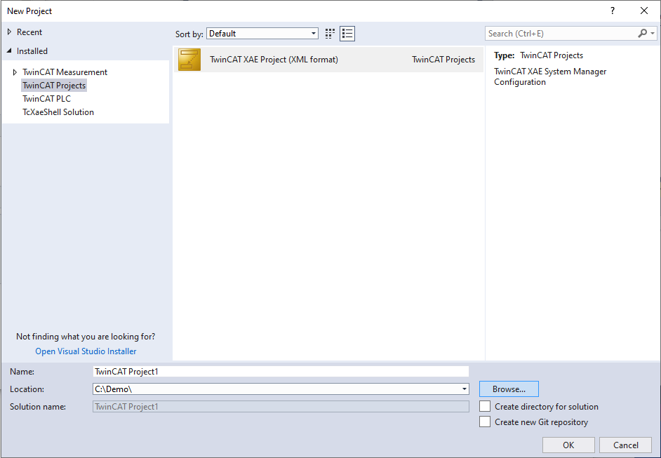

# Getting started

This guide will get you started with struckig. Here you will learn how to install the library into you TwinCAT environment and use the library to calculate and propagate through a very simple trajectory. Experienced users of TwinCAT, who have worked with third-party libraries before, may skip this part and directly jump to advanced examples.

## Installation

The struckig library can either be downloaded from Github as a [precompiled library](https://github.com/stefanbesler/struckig/releases), or you can clone the [repository](https://github.com/stefanbesler/struckig) and compile the library yourself. This guide will focus on the former usecase.

First, [get the latest release](todo) of the library, the download will give you a file called "struckig_0.4.0.0.compiled-library" on your computer. Note that the version number may differ from the file you actually downloaded. At the time of writing this text, the file is called . Start the TwinCAT XAE Shell or the Visual Studio Version you are usually using to develop TwinCAT PLCs. Then, in the menubar, select **PLC** and then **Library Repository...** (see figures below)

<div class="gallery">
  <div class="gallery-item">
    <figure>
      
      <figcaption>TwinCAT XAE Shell</figcaption>
    </figure>
  </div>
  <div class="gallery-item">
    <figure>
      
      <figcaption>Library repository</figcaption>
    </figure>
  </div>  
</div>

In the library-repository dialog click on **Install** and navigate to the file compiled-library file and select it. Then, click on **Open** to install the struckig library into your TwinCAT environment and you are ready to use it.

## PLC

Once the struckig library is installed on your system you may use it in any PLC you like accordingly to the [GPLv3 licence](https://www.gnu.org/licenses/gpl-3.0.en.html). Usually you will already have a PLC, but for demonstration purposes we will start from a plain TwinCAT XAE shell. In the menubar click on **File** and then select **New > Project**.

<div class="gallery">
  <div class="gallery-item">
    <figure>
      
      <figcaption>TwinCAT XAE Shell</figcaption>
    </figure>
  </div>
  <div class="gallery-item">
    <figure>
      
      <figcaption>Create a new project</figcaption>
    </figure>
  </div>
  <div class="gallery-item">
    <figure>
      
      <figcaption>Add a new PLC</figcaption>
    </figure>
  </div>
  <div class="gallery-item">
    <figure>
      
      <figcaption>Create a new Standard PLC project</figcaption>
    </figure>
  </div>  
</div>

In the dialog, create a new **TwinCAT XAE Project (XML format)**, give the project a proper **Name** and **Location** and click on **Ok** to continue. The next step is to create **PLC** in your TwinCAT project by right-clicking on **PLC** in the **Solution Explorer**. In the contextmenu select **Add new item...**. In the dialog, select **Standard PLC Project**, give it a **Name** and click on **Add**.

We are now done and in fact usually you will start from this point. To make the struckig library available to the PLC right-click on **References** and select **Add library**. In the dialog search for ***struckig***, select the item and click on **Ok**

<div class="gallery">
  <div class="gallery-item">
    <figure>
      
      <figcaption>Add a library</figcaption>
    </figure>
  </div>
  <div class="gallery-item">
    <figure>
      
      <figcaption>Add the struckig library</figcaption>
    </figure>
  </div>  
</div>

To write your first program, which utilizes the struckig library, replace the content of the **MAIN** program by the following source code.

```st
// --- Declaration -------------------------------------
PROGRAM MAIN
VAR
  otg : Struckig.Struckig(cycletime:=0.001, dofs:=1) := (
    EnableAutoPropagate := TRUE,
    MaxVelocity :=         [ 2000.0 ],
    MaxAcceleration :=     [ 20000.0 ],
    MaxJerk :=             [ 800000.0 ],
    CurrentPosition :=     [ 0.0 ],
    TargetPosition :=      [ 100.0 ]
  );
  ActPosition : LREAL;
END_VAR

// --- Implementation ---------------------------------
otg();
ActPosition := otg.NewPosition;
```

This is probably the most basic application, which you can implement with the struckig trajectory-generator. The code initializes a trajectory for a single axis (`dofs:=1`) in a PLC with a cycletime of 10ms. The latter value should match the **Cycle ticks** of your task (defaults to 10ms). The program calculates and a trajectory from `position=0` to `position=100`, parametrized with a maximum velocity, acceleration and jerk in arbitrary units (typically mm or degree). In the implementation part the trajectory generator is called every cycle. The output parameter **NewPosition** can be send to control an actual, phyiscal axis. The option **EnableAutoPropagate** automatically updates the trajectory after each call. Disabling the parameter is useful for offline trajectory generation, usually you can always set this to `TRUE`.

> [!NOTE]
> This is the most basic example. There are many more settings that can be used for this trajectory generator, 
> such as 
>   * Minimum durationt
>   * Current values for velocity and acceleration
>   * Target values for velocity and acceleration
>   * Minimum values for velocity and acceleration
>   * Synchronization options for multiple axes
>   * Control mode to calculate velocity profiles instead of position profiles for a controlled stop or variable-frequency-drives (VFD)

> [!NOTE]
> Compiling the library yourself and as .library instead of .compiled-library will make some internal variables available to you. While this may facilates debugging 
> for tinkers , the compiled-library has purposly stripped to the variables and application engineer may find useful.
